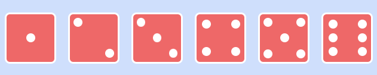
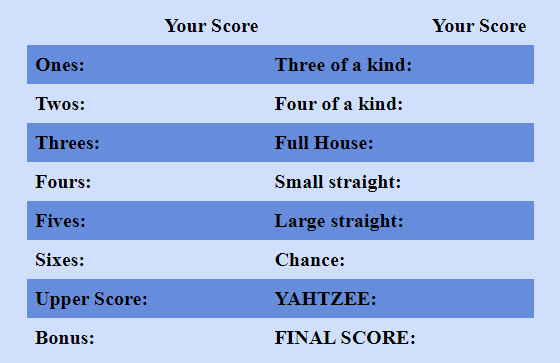

# Yahtzee Game Design Documentation - Vy Cao

## Introduction

This document provides the information about design and style of our Yahzee game project. This document will help us keep tracking our design system approach to ensure consistency, clarity and enhance the user experience.

## Game Overview

Yahtzee is a well-known dice game that blends luck and strategy. Players roll dice to create specific combinations, each with designated scores. The game comprises 13 rounds, aiming to accumulate the highest possible score. The detailed instruction will be provided below.

## Design System

### Colors Palette

- Primary Color: #cfdffc - Used for background. 
- Secondary Color: #668ddb - Used for highlight
-  Secondary Color: #ee6868 - Used for dice.
- Tertiary Color: #fff - Used for text.

### Typography
- Headings: Arial Bold - Large, clear headings for sections.
- Subheadings: Times New Roman Italic - Subtle and stylish subheadings.
- Body Text: Calibri - Simple and readable for instructions and content.

### Dice Look and Feel

Our Yahtzee dice offer a distinctive mix of classic style and contemporary design. Each die features a clean tomato hue, and the dots are displayed in white hue. The rounded edges of the dice contribute to an improved user experience.

### Game Mock-ups

- 
- 

### Playing Instructions
- Rolling the Dice: Player can roll the dice up to three times in each turn.
- Scoring: The user can select points based on the dice combination rolled in each turn.
- Game End: Once all scorecard combinations are filled, the final score will be the total of score and bonus. 

### User Interaction
- When the user hover the mouse over a specific "Point label" (Full House), the instruction and detail information about the full house point will be displayed.
- When the user click "Roll Dice" button, the dice will be rolled 3D with animation affect

## Conclusion

This design document serves as a foundation for our Yahtzee game development. Following these guidelines ensures we deliver a game that's not only fun to play but also visually appealing and user-friendly.